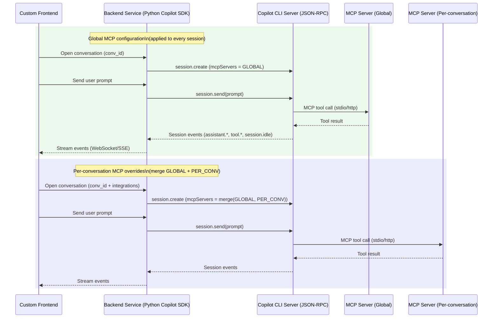

# Setting Up MCP with the GitHub Copilot SDK for Python

## Executive summary

The “Copilot SDK Python package” you referenced is the **`github-copilot-sdk`** package published on the entity["organization","Python Package Index","package registry"]. Its primary job is **programmatic control of the Copilot CLI agent runtime via JSON‑RPC**, not implementing the MCP server itself. citeturn20search1turn23view0

“MCP” in this ecosystem means **Model Context Protocol**, an open standard for exposing tools/resources to LLM applications. With the Copilot SDK, you *integrate* MCP servers by passing an **`mcp_servers`** configuration into **session creation / session resume**; the MCP servers run as **separate processes (stdio/local) or remote endpoints (HTTP/SSE)** and expose tools the agent can call. citeturn7search1turn13view0turn6view0

To support **global MCP configuration** plus **per‑conversation overrides** for a custom frontend, the key implementation pattern is:

- Maintain a **global `dict[str, MCPServerConfig]`** in your backend (or load it from your own config store).
- For each conversation (mapped to a stable **`session_id`**), create or resume a session using `CopilotClient.create_session()` / `CopilotClient.resume_session()` with a merged `mcp_servers` dict.
- Stream session events (assistant deltas, tool events, idle) to your frontend using **`CopilotSession.on()`** and optionally `CopilotSession.send()` + event-driven completion, or `CopilotSession.send_and_wait()` for synchronous request/response semantics. citeturn11view0turn16view0turn34view0turn19view0

Two SDK details matter operationally:

- The Python package currently requires **Python 3.11+**; the user’s “3.10+” assumption conflicts with the published requirement. citeturn3view0turn29search0  
- As of SDK v0.1.32, the Python runtime enforces a required **`on_permission_request`** handler at session creation (and similarly when resuming), which becomes your most practical **authorization gate** for tool/MCP usage. citeturn11view0turn13view0

## Terminology and architecture

### What MCP is in this context

In Copilot SDK documentation, MCP is explicitly **Model Context Protocol** and MCP servers “run as separate processes and expose tools (functions) that Copilot can invoke during conversations.” citeturn7search1turn6view0

MCP servers typically use transports such as:

- **Local / stdio**: subprocess communicating over stdin/stdout  
- **HTTP/SSE**: remote server accessed over HTTP, with SSE as a supported type in the Copilot SDK’s config surface citeturn7search1turn13view0

### Where the Copilot SDK fits

The Copilot SDK (Python) is a client for controlling the agent runtime packaged in the Copilot CLI, using JSON‑RPC and either stdio or TCP. citeturn20search0turn23view0turn22view0

In other words:

- Your backend **does not become an “MCP server”** by using the Copilot SDK.
- Your backend uses the Copilot SDK to create agent sessions that can call tools from MCP servers you configure.

If you need to **build** an MCP server in Python, that is typically done with the separate MCP Python SDK (package `mcp`), which provides server frameworks like `FastMCP`. citeturn24view0

## SDK inventory and installation

### Package name and versions

The PyPI package for the Copilot SDK Python runtime is **`github-copilot-sdk`**. citeturn3view0turn7search4

As of **March 7, 2026**, the upstream repo’s latest release tag is **v0.1.32**. citeturn18search5turn20search3

The package requires **Python 3.11+** (not 3.10+). citeturn3view0turn29search0

### Installation steps

Core prerequisites include ensuring the Copilot CLI is installed and functional (e.g., `copilot --version`) and authenticated for non‑BYOK scenarios. citeturn20search2turn31view0

Install the SDK:

```bash
pip install github-copilot-sdk
```

This is explicitly the Python install command shown in the official getting started guide. citeturn20search2

### Relevant Python modules and source files

The SDK’s Python implementation is structured around these modules (each is directly relevant to MCP/session setup):

- `copilot/client.py` — `CopilotClient` and session creation/resume logic, including mapping `mcp_servers` to wire payload (`mcpServers`). citeturn8view0turn11view0  
- `copilot/session.py` — `CopilotSession`, event subscription (`on()`), send primitives (`send()`, `send_and_wait()`), tool/permission dispatch behavior, hooks execution. citeturn16view0turn34view0  
- `copilot/types.py` — TypedDict schemas for `SessionConfig`, `ResumeSessionConfig`, MCP server config unions, hook handler signatures, permission handler signatures, etc. citeturn13view0turn22view0  
- `copilot/tools.py` — `define_tool()` helper for creating *custom SDK tools* (distinct from MCP tools), including automatic schema generation and sync/async wrapping. citeturn17view0turn17view3  
- `copilot/jsonrpc.py` — transport/client implementation; thread + asyncio design, request timeouts, base exceptions. citeturn23view0turn23view3  
- `copilot/generated/*` — generated RPC types and event types referenced by `CopilotSession.rpc` and event parsing. citeturn16view0turn34view0  

## Required Python APIs and signatures

This section is intentionally “mechanical”: it lists the concrete classes/functions you must use for (a) global + per‑conversation MCP configuration and (b) frontend integration.

### Core classes and methods

#### `CopilotClient` essentials

The `CopilotClient` is “the main client for interacting with the CLI”, and can spawn the CLI server or connect to an existing server. citeturn10view0turn23view0

Key signatures (Python):

| API | Signature | Purpose | Notable exceptions / constraints |
|---|---|---|---|
| Constructor | `CopilotClient(options: CopilotClientOptions \| None = None)` | Configure CLI path/transport/auth and initialize client object. citeturn21view0turn22view0 | Raises `ValueError` for mutually exclusive options (e.g., `cli_url` with `cli_path`/`use_stdio`). citeturn21view0turn21view7 |
| Start | `async start(self) -> None` | Start/attach to CLI server; auto-called if `auto_start` is True. citeturn10view1turn11view0 | Raises `RuntimeError` on failure; wraps process exit details when available. citeturn11view0turn32view0 |
| Stop | `async stop(self) -> None` | Disconnect sessions, stop RPC transport, terminate spawned CLI process. citeturn11view0turn25view4 | Can raise `ExceptionGroup("errors during CopilotClient.stop()", errors)` with `StopError` entries. citeturn11view0turn25view4 |
| Force stop | `async force_stop(self) -> None` | Emergency “kill” without graceful cleanup. citeturn11view0turn25view4 | Intended when `stop()` hangs/fails. citeturn11view0 |
| Create session | `async create_session(self, config: SessionConfig) -> CopilotSession` | Create a new conversation session. This is where `mcp_servers` (session-scoped) is attached. citeturn11view0turn13view0 | **Requires** `on_permission_request`; raises `ValueError` if missing. citeturn11view0turn10view4 |
| Resume session | `async resume_session(self, session_id: str, config: ResumeSessionConfig) -> CopilotSession` | Resume an existing session and optionally reconfigure settings, including `mcp_servers`. citeturn11view0turn10view4 | Also enforces `on_permission_request` and raises `ValueError` if missing. citeturn10view4turn11view0 |
| List sessions | `async list_sessions(self, filter: SessionListFilter \| None = None) -> list[SessionMetadata]` | Enumerate sessions known to server, useful for admin/debug. citeturn10view1turn21view3 | Raises `RuntimeError` if not connected. citeturn21view3 |
| Delete session | `async delete_session(self, session_id: str) -> None` | Permanently delete a session from disk. citeturn25view0 | Raises `RuntimeError` if deletion fails. citeturn25view0 |
| Get last session id | `async get_last_session_id(self) -> str \| None` | Convenience for “resume most recent”. citeturn21view4 | Returns `None` if no sessions exist. citeturn21view4 |

**Client options you will actually use for custom apps** are defined by `CopilotClientOptions` (TypedDict). The most important fields for backend/frontend deployment are `cli_path`, `use_stdio`, `cli_url`, `log_level`, plus authentication fields like `github_token` and `use_logged_in_user`. citeturn22view0turn22view2turn21view7

#### `CopilotSession` essentials

A `CopilotSession` is the “single conversation session” object created/resumed from the client. citeturn16view0turn34view0

Key signatures (Python):

| API | Signature | Purpose | Notable exceptions / behavior |
|---|---|---|---|
| Send | `async send(self, options: MessageOptions) -> str` | Queue a message and return immediately with `messageId`. citeturn16view0turn13view0 | Intended for event-driven streaming; doesn’t block for completion. citeturn16view0 |
| Send and wait | `async send_and_wait(self, options: MessageOptions, timeout: float \| None = None) -> SessionEvent \| None` | Convenience: waits for `session.idle` (default effective timeout 60s) and returns last assistant message event. citeturn16view0turn34view0 | Raises `TimeoutError` if `session.idle` not observed in time. citeturn16view0 |
| Subscribe to events | `def on(self, handler: Callable[[SessionEvent], None]) -> Callable[[], None]` | Register a callback for all session events; returns an unsubscribe function. citeturn16view0turn14view2 | Handler errors are caught and printed; they do not propagate to the caller. citeturn16view0 |
| Get messages | `async get_messages(self) -> list[SessionEvent]` | Pull the full session event history from the server. citeturn34view0 | Fails if disconnected/connection fails. citeturn34view0 |
| Disconnect | `async disconnect(self) -> None` | Release in-memory resources while preserving on-disk state for later resume. citeturn34view0turn19view0 | After disconnect, the session object should not be used. citeturn34view0 |
| Abort in-flight work | `async abort(self) -> None` | Cancel current processing; session remains usable. citeturn34view0 | Useful for frontend Cancel button semantics. citeturn34view0 |
| Change model | `async set_model(self, model: str) -> None` | Switch model for next message; state preserved. citeturn34view0 | Calls typed session RPC `model.switch_to`. citeturn34view0 |

### MCP configuration structures

The **only supported MCP integration surface in the Python SDK** is configuration passed via `SessionConfig.mcp_servers` (and similarly for `ResumeSessionConfig.mcp_servers`). citeturn13view0turn11view0turn10view3

#### MCP config union types

In `copilot/types.py`, MCP servers are expressed as a union:

- `MCPLocalServerConfig` (local/stdio subprocess)
- `MCPRemoteServerConfig` (HTTP or SSE endpoint)
- `MCPServerConfig = MCPLocalServerConfig | MCPRemoteServerConfig` citeturn13view0turn22view5

Key fields:

| Field | Local/stdio (`MCPLocalServerConfig`) | Remote (`MCPRemoteServerConfig`) | Notes |
|---|---:|---:|---|
| `tools: list[str]` | ✅ | ✅ | `["*"]` = all tools; `[]` = none; or list specific tools. citeturn13view0turn30view0 |
| `type` | `Literal["local","stdio"]` (optional) | `Literal["http","sse"]` (required) | Remote supports explicit `http` and `sse`. citeturn13view0 |
| `timeout` | ✅ (ms) | ✅ (ms) | Tool-call timeout at MCP layer (distinct from SDK send-and-wait). citeturn13view0turn30view0 |
| `command`, `args` | ✅ | ❌ | Subprocess invocation for local MCP servers. citeturn13view0turn30view0 |
| `env`, `cwd` | ✅ | ❌ | Execution environment + working directory for server. citeturn13view0turn30view0 |
| `url`, `headers` | ❌ | ✅ | Remote endpoint plus auth headers. citeturn13view0turn18search3 |

#### Where MCP config is attached on the wire

When you pass `mcp_servers` in a session config, `CopilotClient.create_session()` maps it into the JSON-RPC payload as `mcpServers` and sets `envValueMode` to `"direct"`. citeturn11view0turn10view3

This mapping is the mechanism by which your session gains MCP tools; there is no separate “register MCP server” API in the Python SDK.

### Authorization and lifecycle hooks you must wire

#### Permission handling

The SDK’s server can request permission before executing actions (including tool calls), and the Python SDK requires you to provide a permission handler when creating a session. citeturn11view0turn13view0

- Type: `Callable[[PermissionRequest, dict[str, str]], PermissionRequestResult | Awaitable[PermissionRequestResult]]` citeturn13view0turn22view2  
- Built-in helper: `PermissionHandler.approve_all(request, invocation) -> PermissionRequestResult` citeturn13view0turn12view4  

The session internally invokes the permission handler and denies by default if no handler is registered or the handler fails. citeturn34view0

#### Hooks

Session hooks are an additional interception layer (pre/post tool use, session start/end, etc.) with typed keys inside `SessionHooks`. citeturn13view0turn34view0turn29search0

Notably, the pre-tool hook can set `permissionDecision` and can also modify tool arguments, giving you another practical authorization choke point for MCP tools. citeturn13view0turn34view0turn29search0

### Async vs sync variants and concurrency model

- The public SDK is **async-first**: key operations are `async` (`start`, `create_session`, `send`, `send_and_wait`, etc.). citeturn11view0turn16view0turn23view0  
- Internally, the JSON-RPC transport uses **threads for blocking I/O** but presents an async interface (`JsonRpcClient`). citeturn23view0turn23view3  
- Session event handlers registered via `session.on()` are **synchronous callbacks** (`Callable[[SessionEvent], None]`). If you need to send messages to a websocket asynchronously, your handler should schedule asyncio tasks rather than blocking. The SDK itself uses `asyncio.ensure_future(...)` internally for responding to broadcast tool/permission request events. citeturn16view0turn34view0  
- The session persistence guide warns the SDK has **no built-in session locking**, and concurrent access to the same session is “undefined,” implying you must add application-level locking/queuing for multi-client frontends. citeturn19view0  

## MCP configuration patterns for global vs per-conversation setups

### What “global vs per-conversation” means in practice

The Copilot SDK’s MCP configuration is **session-scoped**, not process-scoped, meaning “global” and “per-conversation” are patterns you implement in your backend:

- **Global MCP configuration**: a common baseline `mcp_servers` dict that you include in *every* session you create/resume.
- **Per-conversation MCP configuration**: additional MCP servers (or tool allowlists) merged in based on conversation metadata (tenant, repo, project, user choice), passed only for that session. citeturn13view0turn11view0turn19view0

There is an open enhancement request asking the SDK to auto-load MCP servers from a default file like `~/.copilot/mcp-config.json`, indicating this “global config loading” is not currently a first-class API in the SDK. citeturn18search0

### Minimal global MCP configuration example

This example uses:
- One local stdio MCP server (`command`/`args`)
- One remote server (SSE) with `headers` for auth
- A permissive permission handler for demonstration

```python
import asyncio
from copilot import CopilotClient, PermissionHandler

GLOBAL_MCP_SERVERS = {
    "my-local-mcp": {
        "type": "local",
        "command": "python",
        "args": ["-m", "my_mcp_server_module"],
        "env": {"MCP_DEBUG": "1"},
        "tools": ["*"],
        "timeout": 30_000,
    },
    "my-remote-mcp": {
        "type": "sse",
        "url": "https://mcp.example.com/sse",
        "headers": {"Authorization": "Bearer <token>"},
        "tools": ["*"],
        "timeout": 30_000,
    },
}

async def main():
    client = CopilotClient({"log_level": "info"})
    await client.start()

    session = await client.create_session(
        {
            "session_id": "conv-global-001",
            "model": "gpt-4.1",
            "mcp_servers": GLOBAL_MCP_SERVERS,
            "on_permission_request": PermissionHandler.approve_all,
            "streaming": True,
        }
    )

    # Use streaming events rather than blocking response
    done = asyncio.Event()

    def on_event(event):
        if event.type.value == "assistant.message_delta":
            print(event.data.delta_content or "", end="", flush=True)
        elif event.type.value == "session.idle":
            done.set()

    session.on(on_event)

    await session.send({"prompt": "Use available tools to summarize today's open PRs."})
    await done.wait()

    await session.disconnect()
    await client.stop()

asyncio.run(main())
```

This is structurally aligned with: (a) the session config fields in `SessionConfig`, (b) the MCP server config shapes, and (c) the event patterns described/implemented by `send()`, `send_and_wait()`, and `on()`. citeturn13view0turn11view0turn16view0turn34view0

### Minimal per-conversation override example

A robust approach is a deterministic merge where per-conversation wins by key; you can also do deeper merges if you want to “add headers” or “append tools allowlists”.

```python
from copy import deepcopy

def merge_mcp_servers(global_cfg: dict, per_conv_cfg: dict | None) -> dict:
    merged = deepcopy(global_cfg)
    if per_conv_cfg:
        # per-conversation servers override or add new entries
        merged.update(per_conv_cfg)
    return merged
```

Then create or resume the session with the merged config:

```python
async def get_or_create_session(client, conversation_id: str, per_conv_mcp: dict | None):
    mcp_servers = merge_mcp_servers(GLOBAL_MCP_SERVERS, per_conv_mcp)

    # If you persist session IDs, reuse them for resume/persistence.
    return await client.create_session({
        "session_id": conversation_id,
        "model": "gpt-4.1",
        "mcp_servers": mcp_servers,
        "on_permission_request": PermissionHandler.approve_all,
        "streaming": True,
    })
```

Why session IDs matter: the official persistence guidance emphasizes that a stable `session_id` is the key to resumable sessions and production patterns. citeturn19view0turn13view0

### Notes on custom agents and per-agent MCP

The types surface supports MCP servers within `CustomAgentConfig` via `mcp_servers: NotRequired[dict[str, MCPServerConfig]]`. citeturn13view0

However, there is a reported issue that MCP servers attached inside `CustomAgentConfig` are not exposed to the agent during execution, even though the config is passed. If you require per-agent MCP isolation, treat this as a potential limitation and validate on your target SDK/CLI versions. citeturn18search1

## Custom frontend integration and message flow

### What you stream to the frontend

For a rich custom UI, you typically stream:

- `assistant.message_delta` (incremental text)
- `assistant.message` (final message)
- tool execution events (start/complete) if you want tool traces
- `session.idle` to mark completion
- error events (`session.error`) to surface failures

The Python session implementation is explicitly designed for this: `send()` queues work and you subscribe with `session.on()` to receive events. `send_and_wait()` is a convenience wrapper that waits for `session.idle`. citeturn16view0turn34view0turn29search0

### WebSocket integration pattern

Because `session.on()` handlers are synchronous and you usually want async websocket sends, schedule an `asyncio.create_task(...)` from within the handler (mirroring how the SDK itself uses `asyncio.ensure_future(...)` internally). citeturn16view0turn34view0

A minimal server-side approach:

- One `CopilotClient` per backend process (or per user/tenant depending on isolation needs)
- One `CopilotSession` per conversation id
- A per-session asyncio Lock to serialize prompts if your UI allows multiple rapid sends

The session persistence guide provides two deployment patterns: “one CLI server per user” for isolation and “shared CLI server” for resource efficiency (requiring access control and careful session ID handling). citeturn19view0

### Mermaid sequence diagram of message flow



This aligns with the SDK’s described architecture (SDK ↔ CLI via JSON‑RPC) and the explicit “MCP servers run as separate processes or remote endpoints” concept. citeturn20search0turn7search1turn23view0

## Testing, debugging, and operational tips

### Debug logging and log locations

The cross-SDK debugging guide recommends enabling verbose logging via the client’s `log_level` (Python: `{"log_level": "debug"}`). citeturn31view0turn22view0

For log directory control, the guide notes that Python’s logging configuration is limited and suggests running the CLI manually with `--log-dir` and connecting via `cli_url` for more advanced logging scenarios. citeturn31view0turn22view0turn21view7

### MCP server debugging checklist and protocol validation

The dedicated MCP debugging guide highlights practical failure modes (server not runnable, tools not enabled, handshake failures) and provides a concrete recommendation: **test your MCP server outside the SDK first**, including sending an `initialize` request and checking `tools/list`. citeturn30view0

This is critical because “tools don’t appear” issues often trace to:
- wrong command path
- missing execute permission
- failure to answer MCP `initialize`
- tool allowlist misconfiguration (`tools: ["*"]`) citeturn30view0turn13view0

### Timeouts you must reason about

There are multiple timeout layers:

- `CopilotSession.send_and_wait(..., timeout=...)` controls how long your backend waits for `session.idle`. It does **not** necessarily abort in-flight work. citeturn16view0  
- MCP server configs can include `timeout` (ms) per MCP server, which may surface as MCP tool call timeout errors. citeturn13view0turn30view0  
- JSON‑RPC requests can time out if a timeout is set at the `JsonRpcClient.request(...)` layer; it raises `asyncio.TimeoutError` when a timeout is supplied. citeturn23view3  

For production UIs, treat `send_and_wait` as a convenience for “simple” endpoints, and prefer streaming + explicit abort (`session.abort()`) for cancel semantics. citeturn34view0turn16view0

### Concurrency and session safety

The SDK itself uses a mixture of threads and asyncio (threads for pipe I/O, async API surface), and it uses locks around handler sets and caches. citeturn23view0turn16view0turn25view4

At the application level, however, the persistence guide is explicit about **no session locking** and undefined concurrent access—so a custom frontend should implement:

- one in-flight message per session (queue/lock)
- idempotent resume semantics (only one resume at a time)
- server-side validation of session IDs for access control in shared-cli deployments citeturn19view0

### Authentication and authorization touchpoints

There are two distinct auth/authorization layers to plan for:

1. **Copilot CLI / provider auth**: controlled via `CopilotClientOptions` (e.g., `github_token`, `use_logged_in_user`) and/or BYOK provider config (not the focus here, but it changes how sessions authenticate). citeturn22view0turn22view2turn31view0  
2. **MCP server auth**: for remote MCP servers, use `headers` in `MCPRemoteServerConfig`. For local servers, pass secrets via `env` (with appropriate secret management). citeturn13view0turn18search3turn30view0  

Finally, treat `on_permission_request` and `hooks.on_pre_tool_use` as your **runtime authorization enforcement points** (deny/allow/ask; filter by tool name; enforce tenant scoping). Their presence is not optional in session creation for the Python SDK. citeturn11view0turn13view0turn34view0

## Appendix: Minimal MCP server implementation in Python

Because the Copilot SDK does not itself implement MCP servers, a minimal Python MCP server is usually built with the MCP Python SDK (`mcp`). The MCP Python SDK documents `FastMCP`, decorators like `@mcp.tool()`, and `mcp.run(...)` for launch. citeturn24view0

Install:

```bash
pip install "mcp[cli]"
```

citeturn24view0

Minimal server:

```python
from mcp.server.fastmcp import FastMCP

mcp = FastMCP("Demo", json_response=True)

@mcp.tool()
def add(a: int, b: int) -> int:
    return a + b

if __name__ == "__main__":
    mcp.run(transport="streamable-http")
```

This mirrors the documented quickstart and provides a tool the Copilot agent can call once you add it to `mcp_servers` (remote HTTP) or run it as a local stdio subprocess depending on your chosen transport. citeturn24view0turn13view0turn7search1